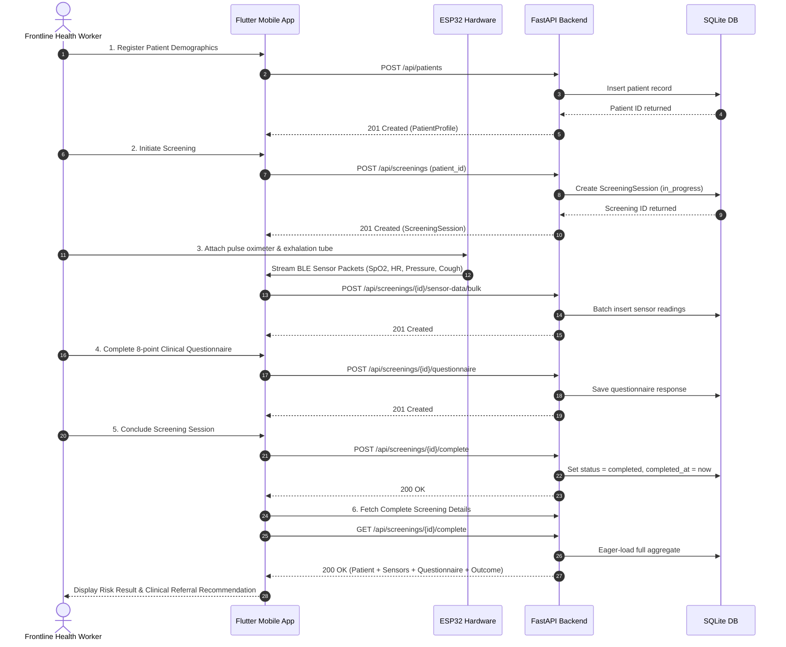

# Screening Sequence & Data Flow Diagram

```mermaid
sequenceDiagram
    autonumber
    actor Asha as Frontline Health Worker
    participant App as Flutter Mobile App
    participant ESP as ESP32 Hardware
    participant API as FastAPI Backend
    participant DB as SQLite DB

    Asha->>App: 1. Register Patient Demographics
    App->>API: POST /api/patients
    API->>DB: Insert patient record
    DB-->>API: Patient ID returned
    API-->>App: 201 Created (PatientProfile)

    Asha->>App: 2. Initiate Screening
    App->>API: POST /api/screenings (patient_id)
    API->>DB: Create ScreeningSession (in_progress)
    DB-->>API: Screening ID returned
    API-->>App: 201 Created (ScreeningSession)

    Asha->>ESP: 3. Attach pulse oximeter & exhalation tube
    ESP->>App: Stream BLE Sensor Packets (SpO2, HR, Pressure, Cough)
    App->>API: POST /api/screenings/{id}/sensor-data/bulk
    API->>DB: Batch insert sensor readings
    API-->>App: 201 Created

    Asha->>App: 4. Complete 8-point Clinical Questionnaire
    App->>API: POST /api/screenings/{id}/questionnaire
    API->>DB: Save questionnaire response
    API-->>App: 201 Created

    Asha->>App: 5. Conclude Screening Session
    App->>API: POST /api/screenings/{id}/complete
    API->>DB: Set status = completed, completed_at = now
    API-->>App: 200 OK

    App->>API: 6. Fetch Complete Screening Details
    App->>API: GET /api/screenings/{id}/complete
    API->>DB: Eager-load full aggregate
    API-->>App: 200 OK (Patient + Sensors + Questionnaire + Outcome)
    App-->>Asha: Display Risk Result & Clinical Referral Recommendation
```
